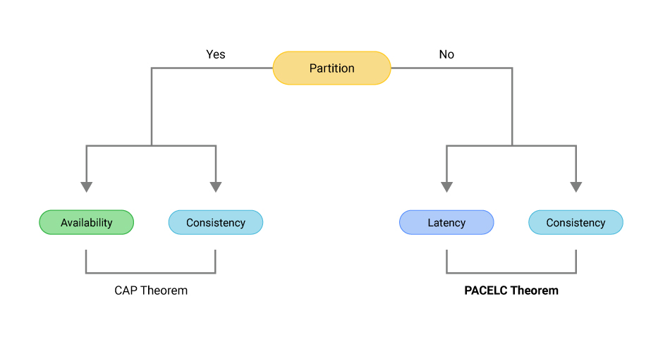
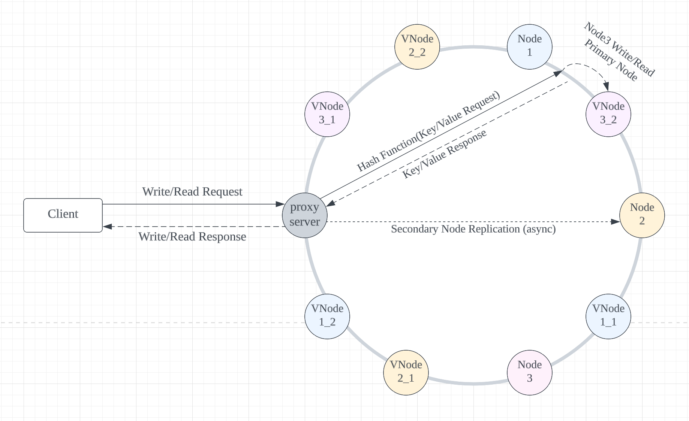
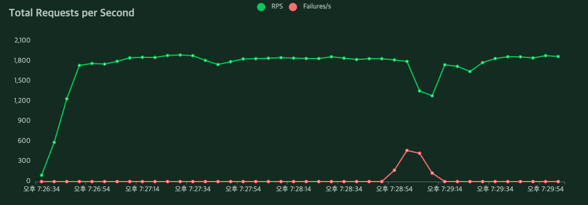

# Distributed-Key-Value-Store (분산 키-값 저장소)
## 배경과 목적

대규모 서비스를 운영하며 분산 시스템은 중요한 요소 중 하나입니다.
대규모 트래픽을 처리하는 애플리케이션을 개발하거나 복잡한 데이터 처리를 해야 하는 시스템을 설계하는 과정에서 분산 시스템에 대한 이해가 필요합니다.
하지만 저에게 분산 시스템은 생소했고, 관련 개념은 멀게 느껴졌습니다.

해당 프로젝트에서는 분산 키-값 저장소를 만드는 과정을 통해, 잘 몰랐던 분산 시스템에 대한 다양한 개념과 흐름을 학습합니다.
PACELC 이론, Consistent Hashing, 데이터의 일관성, 장애 회복성 등에 대한 개념을 소개하고, 분산 시스템에 대한 이해를 높이기 위한 목적을 달성하고자 합니다.

## 분산 시스템이란?

분산 시스템은 서로 다른 머신들에 위치하는 독립된 컴포넌트들의 묶음입니다.
이 묶음은 공통된 목적을 달성하기 위해 서로 메시지를 주고받습니다. 분산 시스템은 하나의 엔드포인트를 갖고 있는 것처럼 나타내어집니다. 하지만 내부적으로는 여러 개의 노드가 목적을 수행함으로써 하나의 시스템에서 장애가 발생하더라도 서비스의 가용성에 영향을 미치지 않는 것처럼 작업을 수행할 수 있습니다.

## 분산 키-값 저장소(Distributed Key-Value Store)

키-값 저장소는 NoSQL 유형의 데이터베이스로 키-값 데이터 쌍을 메모리에 저장하고자 했습니다.

내부의 데이터는 키를 통해서만 접근할 수 있기 때문에 키를 고유 식별자로 갖고자 했고,
키는 일반 텍스트일 수도 있고, 해시값일 수도 있습니다. 키는 성능상의 이슈로 짧을수록 좋으며, 값은 문자열, 객체, 리스트 등 어떤 값도 가능합니다. 이번 프로젝트에서는 구현 편의상 key-value의 데이터 형식을 JSON으로 지정했습니다.

분산 키-값 저장소는 키-값 쌍을 단일 서버가 아닌 여러 서버에 걸쳐 분산시켜 저장하는 방식입니다.
이에 앞서 프로젝트의 컨셉은 플랫폼 서비스에서 외부 협력사 기반의 데이터를 정제하여 메모리에 캐시 하는 사용을 가정하여 진행했습니다.

먼저 분산 시스템을 설계할 경우 CAP 이론에 대해 알 필요가 있었습니다.

### CAP 이론

CAP 이론은 분산 시스템은 세 가지 속성인 일관성(Consistency), 가용성 (Availability), 파티션 감내(Partition tolerance)를 모두 만족하는 설계는 불가능하다는 이론입니다.

- 일관성: 모든 노드는 같은 데이터를 갖고 있어야 한다.
- 가용성: 일부 노드에 장애가 발생하더라도 정상 응답을 받을 수 있어야 한다.
- 파티션 감내: 네트워크 장애가 발생하더라도 시스템은 계속하여 동작해야 한다.

### PACELC 이론

PACELC는 CAP 이론의 `파티션 감내는 필수로 고려해야 한다.`, `네트워크 장애가 아닌 상황을 설명하지 못한다.`라는 한계를 보완하기 위해 나왔습니다.

PACELC는 P(네트워크 파티션) 상황에서 A(가용성)와 C(일관성)를 고려해야 하고,

E(그 외, else) 상황에서 L(지연 시간)과 C(일관성)를 고려해야 하는 것을 말합니다.

이미지 출처: [scylladb](https://www.scylladb.com/glossary/pacelc-theorem/)

네트워크 단절이 일어나 특정 노드에 접근할 수 없을 때 일관성을 위해 데이터 반영을 아예 실패하도록 할 수 있고, 일관성을 포기하고 접근 가능한 노드들에 데이터를 반영할 수 있습니다.
그리고 모든 노드에 데이터를 반영할 경우 그만큼 응답 시간이 길어질 수 있습니다. 이는 일관성이 고려될수록 시스템의 지연 시간이 길어지는 것을 말합니다.

PACELC 이론에 따라 장애 상황/정상 상황의 동작을 고려하면 분산 시스템은 `PC/EC`, `PC/EL`, `PA/EC`, `PA/EL`로 나눌 수 있습니다.

PCEC는 장애 상황 시 일관성을 우선 고려합니다. 정상 상황에서도 일관성을 우선 고려합니다.
이는 데이터의 일관성을 위해 서비스의 지연시간과 지속성을 희생할 수 있습니다.

PCEL은 장애 상황 시 일관성을 우선 고려합니다. 정상 상황에서는 짧은 지연 시간을 고려합니다.
그렇기 때문에 장애 상황 시 가용성을 희생하고 정상 상황 시 일관성을 희생합니다.

PAEC는 장애 상황 시 가용성을 우선 고려합니다. 정상 상황 시 일관성을 고려합니다.

PAEL은 장애 상황 시 가용성을 우선 고려하며 정상 상황 시에도 짧은 지연 시간을 고려합니다.

PACELC가 대략적인 분류 기준을 제시하기는 하지만 그 분류에 속하는 솔루션이라고 해서 무조건 올바른 기술 선정을 의미하지는 않습니다.
다양한 솔루션을 비교하여 비즈니스에 가장 적합한 솔루션을 선택해야 합니다.

분산 키 값 저장소 프로젝트는 외부 연동사에서의 상품 상태를 검증하는 요구사항을 가정하여 이 경우 `PA/EL`를 만족하는 분산 시스템을 설계하는 것을 선택했습니다.

그다음 고려해야 할 것은 요청받은 데이터를 분산하여 저장하는 것이었습니다.

### 데이터 파티션

대규모 트래픽을 처리하는 애플리케이션의 경우 모든 데이터를 한 대의 서버에서 처리하는 것은 불가능합니다.
네트워크나 재해 발생 등의 불특정 장애가 일어날 경우 이는 단일 장애점(Single Point Of Failure, SPOF)이 되어 서비스 운영 중지 상황을 초래하기 때문입니다.

따라서 여러 서버에 데이터 저장해야 하는데 이때 고려해야 하는 점은 `데이터를 여러 서버에 고르게 분산하는 것과 각 서버가 추가/삭제될 때 데이터의 이동을 최소화할 수 있는것` 입니다.

이를 위해서는 분산된 서버들을 조율할 Coordinator Server가 필요했습니다.
해당 서버의 역할은 각 노드의 IP 주소를 알고(service discovery) 클라이언트로부터 인입되는 키-값 저장 요청과 키-값 조회 요청을 부하 분산하는 것입니다.

이에 대한 기성 제품은 Zookeeper, etcd, Eureka 가 있습니다. 하지만 이번 과정에서는 구현 편의를 위해 Proxy 서버를 구성하고 service discovery 역할은 configuration(yml) 파일에 분산 대상의 Application IP를 등록하는 방식으로 진행했습니다.

그리고 트래픽을 분산하는 역할은 `안정 해시`를 도입했습니다.

### 안정 해시(Consistent Hashing)

수평적 규모 확장을 위해서는 클라이언트의 요청을 서버에 균등하게 나누어야 합니다.
안정 해시는 해시 테이블 크기가 조정될 때 평균적으로 키의 개수/슬롯(노드)의 개수 개의 키만 재배치하는 해시 기술입니다.

안정 해시는 해시 링이라는 논리적인 공간을 갖고 있습니다. 이는 해시 공간의 양 끝을 동그랗게 접은 링의 형태라고 상상하시면 좋습니다.
요청이 들어오면 해시 함수를 이용해서 각 서버를 해시 링 위에 배치할 수 있습니다.

그리고 특정 키가 저장되는 서버는 키의 위치로부터 시계 방향으로 링을 탐색하며 만나는 첫 번째 서버입니다.
그렇기 때문에 서버를 추가/제거하더라도 서버마다 구간(파티션)이 나뉘어 있기 때문에 일부 키만 재배치하면 됩니다.

안정 해시는 파티션 크기를 균등하게 유지하지 못하는 문제와 키가 균등 분포되기 어렵다는 문제가 있습니다.
이를 해결하기 위해 가상 노드를 이용할 수 있습니다.

가상 노드(Virtual Node)는 실제 노드를 가리키는 가상의 노드를 의미합니다.
기존의 서버를 물리 노드라고 말하면 하나의 물리 노드는 여러 개의 가상 노드를 가질 수 있습니다.
물리 노드와 가상 노드들은 해시 링 위에 배치될 수 있습니다.

그로 인해 각 노드는 여러 개의 파티션을 관리할 수 있게 됐습니다. 가상 노드의 수가 많아지면 키의 분포는 더욱 균등해져서 데이터가 고르게 분포될 수 있습니다. 이로써 파티션의 크기를 균등하게 유지하지 못하는 문제와 키의 균등 분포 문제를 해결할 수 있습니다.

분산 키 값 저장소 프로젝트에서는 안정 해시를 구현하여 요청을 고르게 분산하도록 했고,  이에 사용되는 해시 함수는 MurmurHash를 채택했습니다.
MurmurHash를 선택한 이유는 비암호화 해시로 암호화의 안정성보다 성능과 해시 충돌의 최소화를 고려하여 만들어진 함수이기 때문입니다.

요청을 각 서버에 고르게 분산하고 난 후에는 높은 가용성과 안정성을 확보하기 위해 데이터 다중화가 필요합니다.

### 데이터 다중화와 데이터 일관성

분산 시스템의 특징에서 높은 가용성(High Availability)과 안정성을 확보하기 위해서는 데이터를 N개의 서버에 비동기적으로 다중화 (replication) 할 필요가 있습니다.

데이터 파티션을 만족하기 위해 안정 해시를 도입했고, 안정 해시는 해시링 위에서 링을 순회하며 만나는 첫 서버에서 요청을 처리합니다.
해당 서버에서 불특정 장애가 발생하는 경우를 대비하여 요청으로 들어온 데이터를 다른 서버에 저장할 필요가 있습니다. 그리고 다중화된 데이터는 적절히 동기화를 하여 일관성을 유지해야 합니다.

데이터의 일관성을 보장할 수 있는 방법으로는 정족수 합의 프로토콜이 있습니다.
정족수 합의 프로토콜은 노드의 개수(N), 쓰기 연산의 정족수(W), 읽기 연산의 정족수(R)를 조정하여 분산된 노드들로부터 일관성의 수준을 조절할 수 있습니다.
일관성의 수준은 크게 강한 일관성, 약한 일관성, 최종 일관성이 있습니다.

- 강한 일관성(Strong Consistency): 모든 읽기 연산은 가장 최근에 갱신된 결과를 반환
- 약한 일관성(Weak Consistency): 읽기 연산은 가장 최근에 갱신된 결과를 반환하지 못할 수 있음
- 최종 일관성(Eventual Consistency): 약한 일관성의 형태로, 갱신 결과가 결국에는 모든 노드에 동기화

분산 키/값 저장소 프로젝트에서 정족수 합의 프로토콜은 구현하지 않았습니다.

이유는 분산 시스템의 큰 흐름을 파악하는 목적에서 정족수 합의 프로토콜 등을 상세히 구현하는 것은 시간의 소요와 프로젝트의 목적에서 벗어날 수 있다고 생각했습니다.
그래서 해당 요소는 학습으로 마무리했습니다.

네트워크 파티션 상황에서 가용성 있는 시스템을 확인해보고자 하기에 Primary 노드와 Secondary 노드에 값을 저장하여 데이터의 다중화와 일관성을 만족하도록 했습니다.

### 장애 감지와 장애 처리

앞서 분산 시스템은 네트워크 파티션 상황을 피할 수 없는 현상으로 분류했습니다.

그 과정에서 장애를 감지하고 장애가 발생한 노드를 처리하는 과정을 학습했습니다. 요구사항의 간소화를 위해 장애 유형은 특정 노드의 일시적인 네트워크 단절로 가정했습니다.
그리고 이를 검증하기 위해 3개의 분산 서비스를 구성하고 1개의 서비스를 ShutDown 했습니다.

기대한 상황은 지속적인 HTTP 요청이 유입될 때 특정 구간에 응답이 실패하고 프록시 서버가 장애가 발생한 노드를 감지 및 처리하여 점진적으로 HTTP 요청이 성공 응답을 받는 것을 가정했습니다. 그와 동시에 HTTP 실패 응답 또한 특정 구간에 늘어났다가 점진적으로 줄어들길 기대했습니다.

테스트는 python 기반의 벤치마크 툴인 locust를 이용했으며, 이를 통해 내결함성을 측정하고자 했습니다.
먼저 테스트 결과는 기대한 시나리오에 부합했습니다.

장애 감지와 처리에 필요한 분산 시스템의 개념은 가십 프로토콜(Gossip Protocol) 입니다.

가십 프로토콜은 P2P 네트워크 환경을 구성하며 노드별로 멤버십 목록을 구성합니다. 멤버는 각 노드의 정보와 Health Check 카운트를 의미하는 Heartbeat Counter를 갖고 있습니다.
그리고 주기적으로 자신의 박동 수를 올리고 멤버십 목록에 구성된 노드끼리 이를 공유합니다.

특정 노드의 Heartbeat Counter가 갱신되지 않으면 그 외의 노드들은 해당 노드에서 장애가 발생한 것으로 판단합니다.

분산 키/값 저장소 프로젝트에서는 Redis를 이용하여 가십 프로토콜을 간략화하여 구성했습니다.
Redis를 이용하여 클라이언트로부터 유입되는 HTTP 요청과 장애 감지에 필요한 기능을 분리했습니다.

그리고 각각의 노드는 본인의 Heatbeat Count를 증가시킨 후 해당 정보를 Redis에 저장했습니다.
이후 Redis에서 멤버십 정보를 갖고 와 다른 서비스의 Heartbeat Count가 갱신되지 않는다면 실패로 간주하고 별도의 실패 카운트를 쌓도록 했습니다.
실패 카운트가 3회 이상 발생하면 해당 서비스에 장애가 발생했다고 판단 후, proxy 서버로 장애 처리를 요청하도록 했습니다.
proxy 서버는 요청을 받아 안정 해시에서 장애가 발생한 노드의 가상 노드를 제거하고, 중복 요청은 Redis를 이용해서 동시성 제어 처리를 했습니다.

### 결론

위와 같은 과정을 거쳐 분산 키/값 저장소를 구현하고 내결함성을 측정하는 테스트를 통해 분산 시스템을 이해할 수 있었습니다.
이를 진행하며 PACELC, 안정 해시, 정족수 합의 프로토콜 등을 알게 됐으며 MongoDB, Cassandra 등 여러 분산 시스템을 이해하는 많은 도움이 됐습니다.

이번 과정에서는 효율적인 시간 사용을 위해 몇 요소를 생략했지만 추후 이를 구체화하여 해당 프로젝트와 다른 개념들을 개선 및 학습할 수 있을 것 같습니다.
